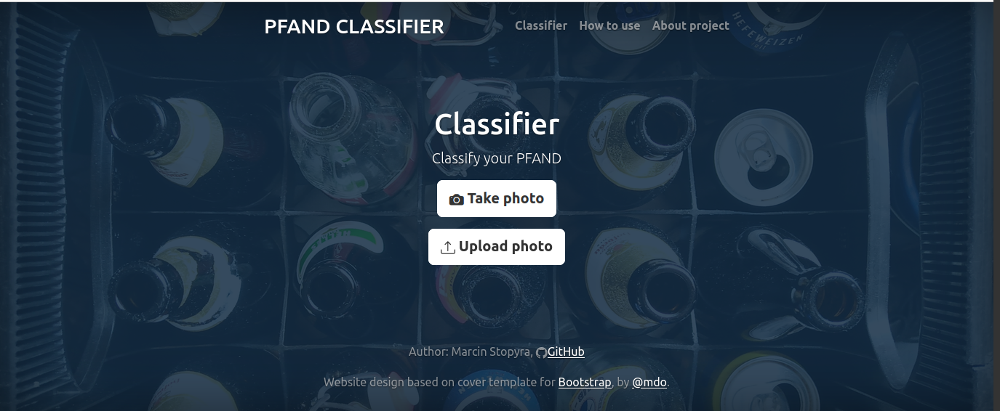
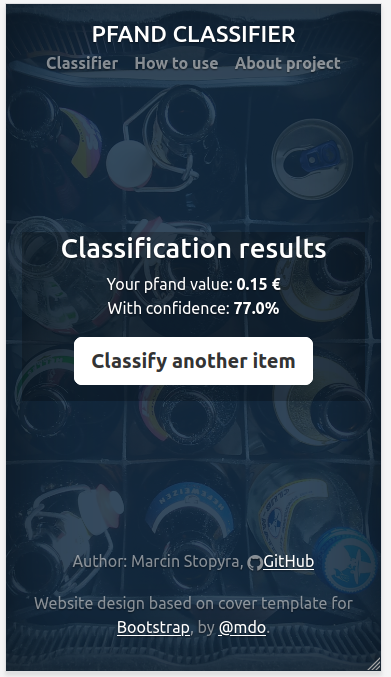

# PFAND CLASSIFIER UI

FastAPI web application with user interface for Pfand Classifier CNN model downsized with use of Tensorflow Lite. App deployed to Heroku and available at [pfand-clf.herokuapp.com/]( https://pfand-clf.herokuapp.com/ ).

## Model

Details about model development available at [Pfand Classifier GitHub repository](https://github.com/marcinstopyra/pfand_clf). The model was converted to Tensorflow Lite model to reduce usage of limited resources.

## FastAPI app

The user interface for the model is a web application prepared with use of FastAPI framework rendering Jinja2 templates. In 1st stage of app development the API returning prediction and its confidence was developped. It is not used in final app, but was left available for tests at [pfand-clf.herokuapp.com/api/docs](https://pfand-clf.herokuapp.com/api/docs). 

## Example app screenshots
- Index view on desktop device
  

- Result view on mobile device  

